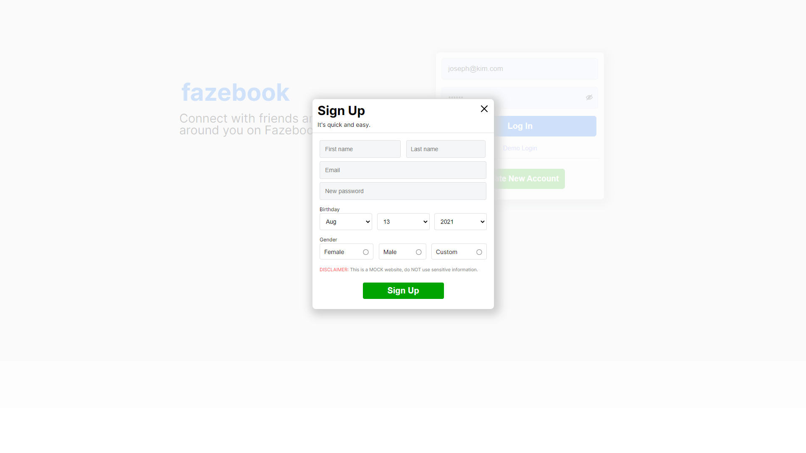
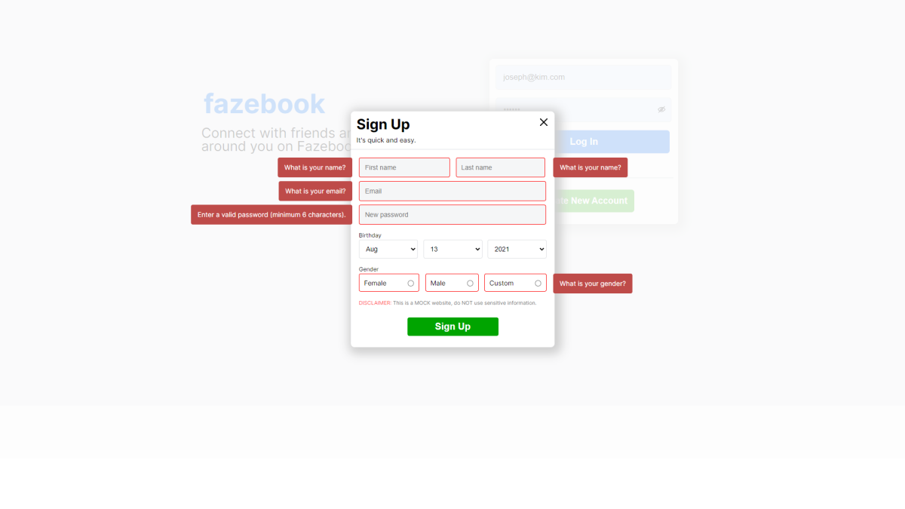
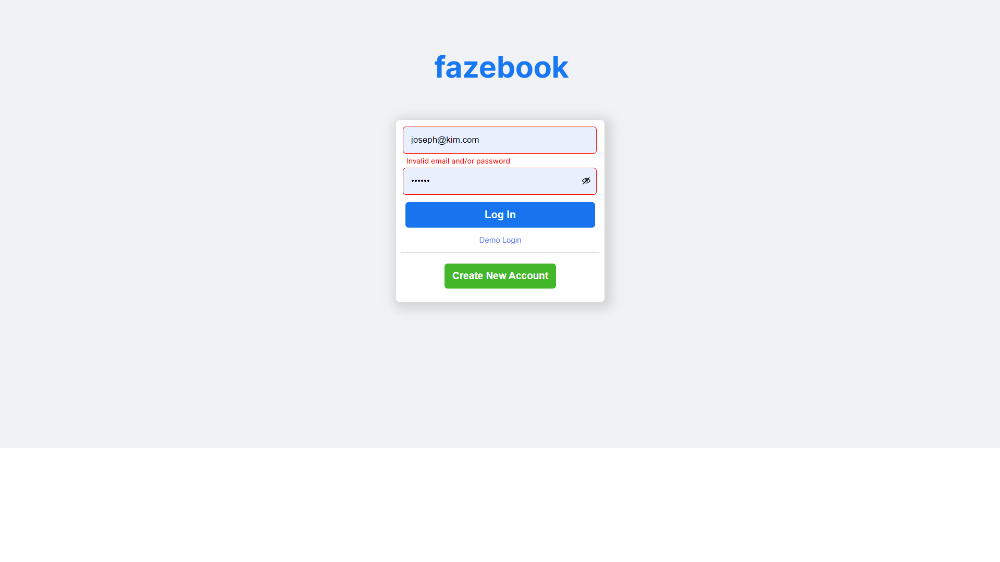

Deployed at https://fazebook.herokuapp.com/

* ***Styling for different size viewports have not been implemented yet. Some content may be offset depending on your viewport size.***

# Background:
- This is Fazebook, a clone of Facebook.

* ***Refer to the WIKI for more details:***
***https://github.com/jkjoeeekim/Phasebook/wiki***

# Technologies, Libraries, APIs:
## This project uses following technologies:
  - Built using `React` to manage front-end routing.
  - Built on a `Rails` framework to manage back-end API routing.
  - `Webpack` to bundle and transpile the source JavaScript code.
  - `Google Fonts API` for font-family: `Inter`.

# Facebook landing page precisely styled

